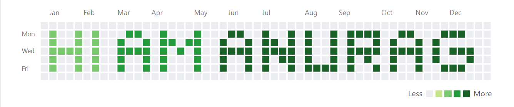

 

 
 
 

> Note: This is not my real contribution graph ;)

Hi, I'm [Anurag Choudhary](https://ycwhencpp.github.io) A FullStack Developer From Delhi,India:

### My top 8 technologies

|||||
|---|---|---|---|
|||||

## I little bit about me

🎓 &nbsp;I'm currently juggling React courses and intend to complete them soon
🌱 &nbsp;I'm on track with learning more about React and DSA.\
✍️ &nbsp;In my free time, I enjoy Music and Gaming.\
✉️ &nbsp;You can drop me an email at ycwhencpp@gmail.com with subject containing "GitHub: ..."! It will be a pleasure to talk with you!.\
📄 &nbsp;Check my [Web page](https://ycwhencpp.github.io) to get to know me a little better.

---

<!-- 
 -->
  

 
 

  <!-- 
 -->

NOTE: This does not indicate my skill level or language proficiency, it's merely a GitHub metric of which languages I have the most code of on GitHub.

---
